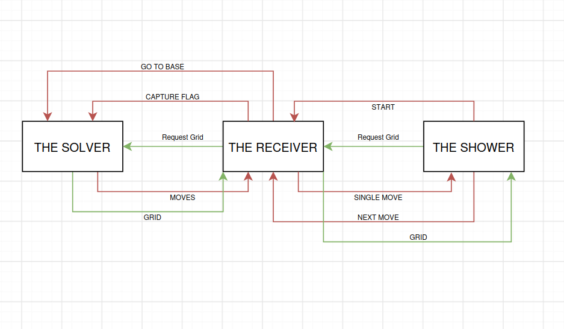
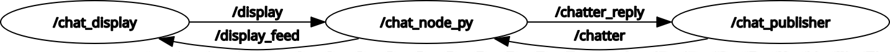
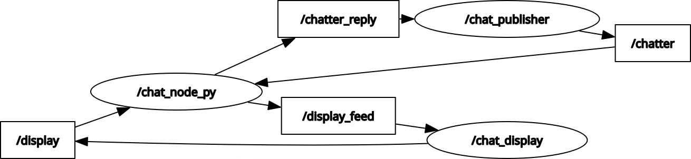
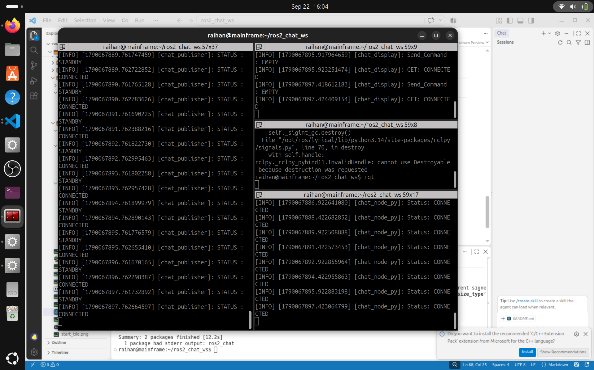
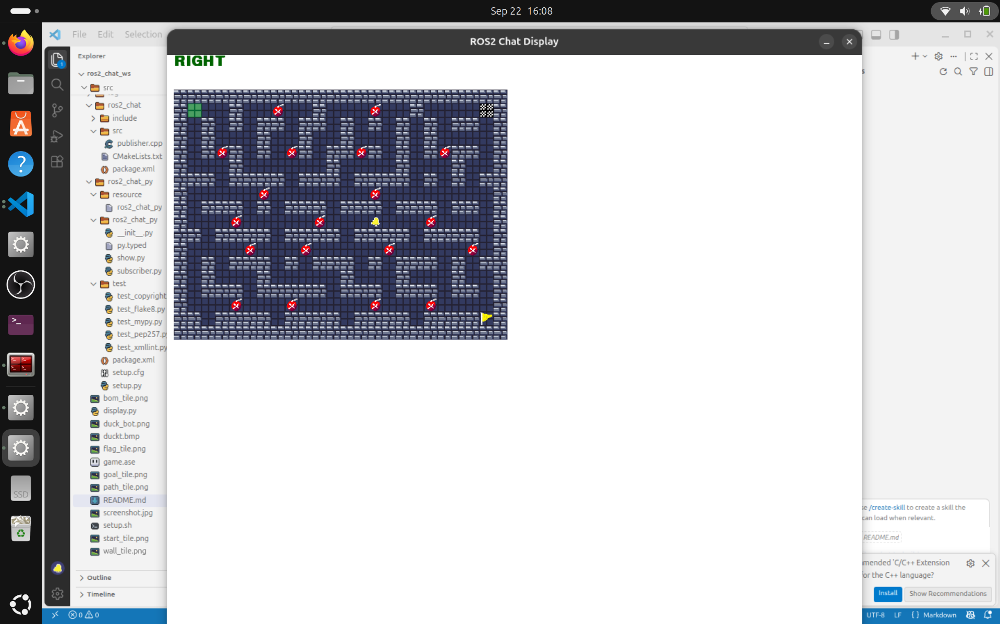
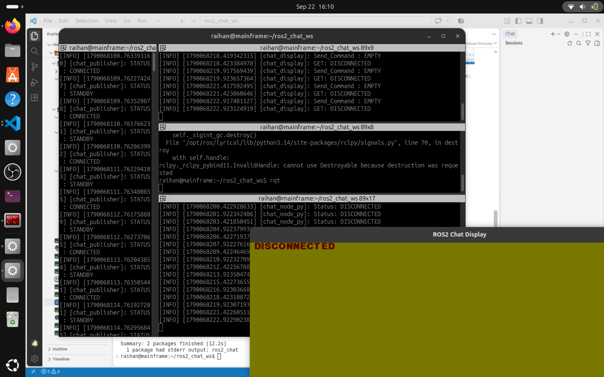

### Berikut adalah Quotes yang menggambarkan tentang kode yang dikerjakan.
```
Make it exist first you can make it good later~

If it somehow works, it works, and dont touch it.
```

#### !!! Fair Play : Beberapa bagian kode ada COPAS dari AI, namun logika berpikir dan penyelesaian masalah terkait mekanisme kode sepenuhnya berasal dari saya, AI membantu saya menyediakan template ROS 2 Lyrycal, seperti temlplate bagaimana komunikasi dua arah dari sebuah node dapat bekerja.

## Latar Belakang
Semua orang tahu bahwa menulis GUI menggunakan C++ adalah mimpi buruk bagi pemula, kompleksitas kode, library yang minim, hingga dukungan yang kurang membuat C++ adalah opsi yang sulit dipilih sebagai sumber kode aplikasi GUI.

Maka hadirlah Python, sebuah aplikasi yang mudah dipahami oleh pemula, instalasi mudah, library yang banyak, hingga dukungan yang melimpah membuat python menjadi opsi paling menggiurkan sebagai sumber kode aplikasi GUI.

"Tapi python lebih lambat dibanding C++."

"Itu Benar."

"Jadi Gimana kalau python hanya sebagai GUI dan kode programnya di C++?"

"Ide menarik, Pakai ROS2!"

Disini masalahnya berasal, saat mengerjakan KPP robotika saya sadar bahwa mengamati ratusan baris keluaran adalah tindakan yang memuakkan, mencari tahu apakah robot bergerak sesuai aturan, apakah jalur yang ditempuh efektif, dan apakah robotnya benar-bener menyelesaikan tugasnya, mencari tahu ini semua dari serangkaian karakter di antara ratusan baris sangatlah sulit, ini baru melihat sebuah keluaran yang tentunya berasal dari program sekali jalan, bagaimana jika ini adalah robot sungguhan yang memiliki puluhan sensor dan ratusan keluaran? Tentunya akan jauh lebih sulit lagi!

Oleh karena itulah kali ini saya mencoba membuat GUI sederhana menggunakan Pygame (Python) untuk menampilkan pergerakan robot dari keluaran tugas KPP robotika (C++).

## Tujuan Program

Seperti yang telah disinggung sebelumnya, program saya akan menerima hasil eksplorasi robot yang diprogram menggunakan C++ kemudian menampilkan pergerakannya melaui Pygame Python.

Tujuan utama program ini adalah untuk mengamati pergerakkan robot setelah dilakukan eksplorasi, guna mempermudah dalam menentukan apakah program sudah sesuai atau tidak, sehingga akan mempermudah dalam proses debugging jika terjadi kesalahan.

## Rancangan Sistem

Program akan dibuat dengan C++ dan Python dengan menggunakan bantuan libary ROS2 (lyrycal) Ubuntu 26, guna menghubungkan tiap program. (Program belum di coba pada versi ubuntu dan libary yang lebih rendah)

Program akan dipisah dengan menggunakan 3 buah program berbeda : 
  * publisher.cpp - program ini akan menerima peintah dari subscriber.py dan memberikan respon terhadap perintah yang dijalankan, seperti mengirim grid dan gerakkan.
  * subscriber.py - Sederhananya ini adalah program penghubung antara publisher.cpp dan show.py, yang menerima perintah dari show.py dan publisher.cpp kemudian memberikan respon yang diperlukan, program ini juga yang memastikan bahwa publisher.cpp dan show.py sudah siap sebelum program utama bisa dijalankan.
  * show.py - program ini akan menampilkan GUI terkait pergerakkan robot yang bersal dari publisher.cpp yang telah diterima dari subscriber.py
  
Ketiga program saling berhubungan, sehingga jika terdapat satu program tidak dijalankan maka program utama tidak akan bisa dijalankan.

Berikut konsep awal program :


Berikut hasil tangkapan layar dari RQT saat program di jalankan :

(Nodes Only)


(Nodes and Topics)


(untuk sementara abaikan penamaanya :))

## Implementasi

## Hasil Pengujian
> Terima-kasih teruntuk Refi yang telah membantu dalam membuat asset gambar, diwaktu yang sangat mepet :)
> 
Berikut adalah tampilan terminal saat ketiga program dijalankan :


Berikut adalah tampilan window pygame saat ketiga program dijalankan :


Berikut adalah tampilan saat salah satu program belum dijalankan :


Video demonstrasi program :
[URL Video Youtube](https://youtu.be/32nZrrdxERg)
## Kesimpulan

Program sudah dapat dijalankan dengan tujuan awalnya yakni menampilkan hasil eksplorasi robot yang dihasilkan oleh program.

Apa yang masih bisa ditingkatkan ?
- Alih-alih terus broadcasting message, program bisa ditingkatkan untuk hanya mengirimkan stau request tiap perintah.
- GUI bisa dikembangkan agar user dapat membuat map sendiri sehingga program akan jauh lebih diamis ketimbang memasukkan grid secara manual pada publisher.cpp.
- Robot yang benar-benar autonomous, program bisa ditingkatkan agar robot benar-benar mencoba memetakan grid sendiri, bukan "meniru" intruksi perintah yang dihasilkan eksplosi program dalam hal ini menggunakan bfs.
- Program menjelajah grid bisa ditambahakan semisal menggunakan dfs, dijkstra atau A*.
- Penamaan variabel dan lain macamnya agar tidak membingungkan.
- Saving state, semisal program tiba-tiba berhenti maka posisi terakhir robot tidak akan direset.
- Menambahkan fitur agar robot dapat berinteraksi dengan objek disekitarnya, jika anda jeli maka anda akan menyadari bahwa robot tidak memiliki interkasi kangsung dengan bom dan dinding, robot sebenarnya dapat bergerak menembus mereka.
- Dan masih banyak lagi perbaikan GUI.
```
Akhir file, Saya mengucapkan terima-kasih banyak kepada pihak ITS Robocon yang telah dengan senang hati dan murah hati menyediakan workshop gratis, ini membuka mata saya terkait kompleksitas dunia Robotika, dan menyenangkannya belajar robotika, program ini sepenuhnya bisa beroperasi sebab materi yang telah diberikan pada Workshop terkait ros2, yang pada alawnya saya sangat kebingungan untuk mengimplementasikannya, terima-kasih banyak juga karena telah menajadi alasan untuk saya belajar terkait ros2 dan eksplorasi terkait ros2, mungkin jika tanpa workshop yang diberikan sampai sekarang saya masih tersesat didalam hutan penuh kegelapan (ehe), program ini benar-benar dikerjakan mulai dari selesai workshop pada hari sabtu, chaotic sekali bagi saya yang masih pemula dalam Ros2, jadi maklumi proyek kecil-kecilan ini, akhir kata semoga ITS ROBOCON JAYA SELALU!!!

Bismillah Bisa Join Tim Riset ROBOCON!!!
```